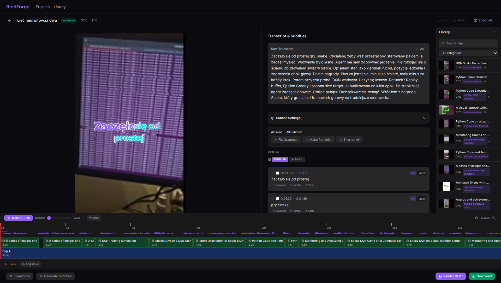
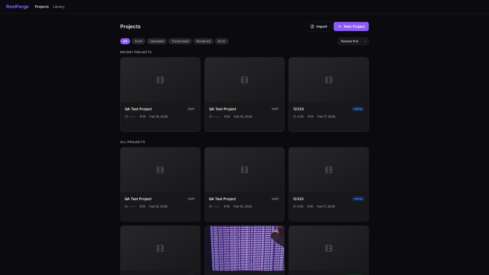
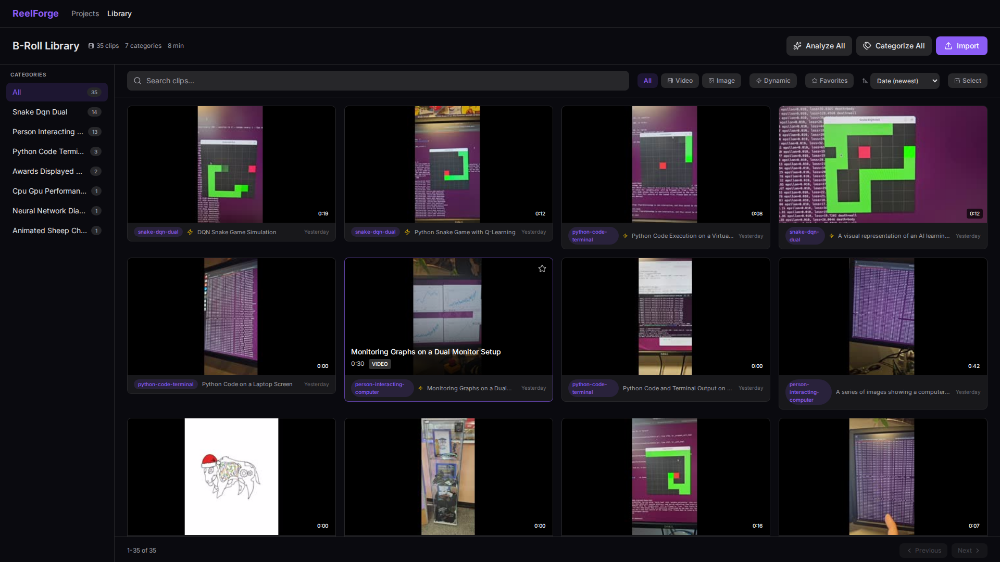

# ReelForge

Local AI-powered reel generator for Instagram and TikTok -- upload footage, auto-transcribe, match B-Roll, style karaoke subtitles, and render production-ready vertical video in one click.



---

## Key Features

- **AI Transcription** -- faster-whisper with word-level timestamps for precise subtitle timing
- **Karaoke Subtitles** -- 5 animation styles (normal, classic, pop, typewriter, bounce) with per-word highlighting
- **B-Roll Library** -- import, categorize, and AI-analyze clips with MiniCPM-V vision model
- **Smart Matching** -- hybrid keyword + embedding search auto-fills your timeline with relevant B-Roll
- **Timeline Editor** -- drag-and-drop with trimming handles, speed control, snap-to-grid, and waveform overlay
- **One-Click Render** -- FFmpeg pipeline with ASS overlay, background music mixing, and real-time WebSocket progress
- **Multi-Language** -- separate subtitle tracks with AI-powered translation and polishing
- **Project Management** -- duplicate, export/import, render history, undo/redo, keyboard shortcuts

---

## Architecture

```
Browser (React 19 + TypeScript + Vite)
  |
  |  REST API + WebSocket (proxied :5173 -> :8000)
  |
FastAPI Backend (Python 3.12)
  |
  +-- Services
  |     +-- Transcription (faster-whisper large-v3)
  |     +-- Subtitle Gen (word grouping + ASS karaoke)
  |     +-- Renderer (FFmpeg pipeline + concat + overlay)
  |     +-- Matcher (keyword filter + embedding rerank)
  |     +-- Vision (MiniCPM-V via Ollama)
  |     +-- Embeddings (sentence-transformers all-MiniLM-L6-v2)
  |     +-- Search (weighted keyword scoring)
  |
  +-- SQLite (projects, clips, timeline, subtitles, categories)
  |
  +-- FFmpeg 6.1 (video processing, waveform gen, thumbnails)
```

### Reel Creation Pipeline

```
Upload Clip A --> Transcribe (Whisper) --> Generate Subtitles
                                              |
                  Match B-Roll <--------------+
                  (keyword + embedding)       |
                       |                      |
                  Build Timeline              |
                  (drag-drop edit)             |
                       |                      |
                  Style Subtitles             |
                  (karaoke + colors)           |
                       |                      |
                  Render (FFmpeg) <-----------+
                       |
                  Download MP4
```

---

## Quick Start

```bash
git clone https://github.com/Beba-ai-ml/reelforge.git
cd reelforge
python3 -m venv .venv
source .venv/bin/activate
pip install -r backend/requirements.txt
cd frontend && npm install && cd ..
./start.sh
```

Open http://localhost:5173

### Prerequisites

| Requirement | Purpose |
|-------------|---------|
| Python 3.12+ | Backend |
| Node.js 20+ | Frontend |
| FFmpeg 6.1+ | Video processing |
| Ollama | Vision analysis (MiniCPM-V) + translation |
| NVIDIA GPU | Whisper + embeddings (RTX 3080 recommended) |

---

## Screenshots

| Dashboard | Library | Editor |
|-----------|---------|--------|
|  |  |  |

---

## Usage

### 1. Create a Project

Click **New Project** on the dashboard. Upload your main clip (MP4, MP3, WAV, or M4A).

### 2. Transcribe

Hit **Transcribe** -- faster-whisper processes your audio with word-level timestamps.

### 3. Generate Subtitles

Click **Generate Subtitles** to auto-group words into styled karaoke chunks. Pick from 5 styles and customize colors, font size, and position per subtitle.

### 4. Match B-Roll

Click **Match B-Roll** to auto-fill your timeline. The matcher extracts visual keywords from your transcript, searches the library by keyword score, then reranks by embedding similarity.

### 5. Edit Timeline

Drag-and-drop to reorder. Drag edges to trim. Adjust speed per clip. The waveform track shows your audio for alignment.

### 6. Render

Choose **Draft** (fast, CRF 28) or **Final** (high quality, CRF 18). Watch real-time progress via WebSocket. Download your finished reel.

---

## How It Works

### Karaoke Subtitles

Words are grouped into subtitle chunks (3-4 words, max 25 chars). Each word carries precise timestamps from Whisper. During render, ASS tags animate each word:

| Style | Effect |
|-------|--------|
| Normal | Instant word highlight, only current word colored |
| Classic | Progressive left-to-right fill (`\kf` tags) |
| Pop | 125% scale bounce on active word |
| Typewriter | Alpha fade-in per word |
| Bounce | Vertical bounce with tail fade |

### B-Roll Matching

The matcher runs a two-phase search for each transcript phrase:

1. **Keyword search** -- scored match against clip titles, summaries, and tags
2. **Embedding rerank** -- cosine similarity between phrase and clip embeddings (all-MiniLM-L6-v2, 384-dim)

Consecutive duplicates are prevented at both matching and placement phases. Gaps under 2 seconds are auto-filled by extending the previous clip.

### Render Pipeline

FFmpeg processes each timeline clip (trim, speed, transitions), generates an ASS subtitle file with karaoke tags, then concatenates everything with subtitle overlay and optional background music mixing. Font sizes scale from CSS pixels to ASS units using `canvas_height / 660`.

---

## Configuration

### Backend (`backend/config.py`)

| Parameter | Default | Description |
|-----------|---------|-------------|
| `WHISPER_MODEL` | `large-v3` | Whisper model size |
| `WHISPER_COMPUTE_TYPE` | `int8_float16` | Quantization for VRAM efficiency |
| `EMBEDDING_MODEL` | `all-MiniLM-L6-v2` | Sentence-transformers model |
| `OLLAMA_MODEL` | `minicpm-v:8b-2.6-q4_K_M` | Vision model for clip analysis |
| `RENDER_CRF_DRAFT` | `28` | Quality for draft renders |
| `RENDER_CRF_FINAL` | `18` | Quality for final renders |
| `MAX_RENDER_HISTORY` | `5` | Renders kept per project |
| `SUBTITLE_MAX_WORDS` | `4` | Max words per subtitle chunk |
| `SUBTITLE_MAX_CHARS` | `25` | Max characters per subtitle chunk |
| `MATCH_MIN_SCORE` | `2` | Minimum keyword score for B-Roll candidates |
| `MATCH_MAX_CONSECUTIVE` | `3` | Max consecutive B-Roll clips |

### Output Formats

| Format | Resolution | Use Case |
|--------|-----------|----------|
| 9:16 | 1080x1920 | Instagram Reels, TikTok |
| 16:9 | 1920x1080 | YouTube |
| 1:1 | 1080x1080 | Instagram Feed |

---

## API

54 REST endpoints + 1 WebSocket organized into 7 route groups:

| Group | Endpoints | Description |
|-------|-----------|-------------|
| Projects | 9 | CRUD, upload, duplicate, export/import |
| AI | 5 | Transcribe, generate subtitles, match B-Roll |
| Subtitles | 6 | CRUD, bulk update, ASS export |
| Render | 3 + WS | Trigger, status, download, progress stream |
| Timeline | 5 | CRUD, reorder |
| Clips | 14 | Import, search, categories, thumbnails |
| AI Clips | 6 | Vision analysis, categorization, embeddings |

Full API documentation available in [DOCUMENTATION.md](DOCUMENTATION.md).

---

## Tech Stack

| Layer | Technology |
|-------|------------|
| Frontend | React 19, TypeScript 5.9, Vite 7.3, Tailwind CSS 4, TanStack Query |
| Backend | FastAPI, SQLAlchemy, Pydantic, aiofiles |
| Database | SQLite |
| AI Models | faster-whisper, sentence-transformers, MiniCPM-V (Ollama) |
| Video | FFmpeg 6.1, ASS subtitles |
| Fonts | Montserrat Bold |

---

## Project Structure

```
reelforge/
  backend/
    api/           # FastAPI route handlers (7 modules)
    services/      # Business logic (9 modules)
    db/            # SQLAlchemy models + session
    utils/         # FFmpeg helpers
    config.py      # All paths and constants
    main.py        # App entry point
  frontend/
    src/
      pages/       # Dashboard, Editor, Library
      components/  # 25+ React components
      hooks/       # useTimeline, useUndoRedo, useKeyboardShortcuts
      api/         # Typed API client
      types/       # TypeScript interfaces
  data/            # Runtime data (SQLite, projects, library, thumbnails)
  scripts/         # Utility scripts
  start.sh         # One-click launcher
```

---

## License

MIT
